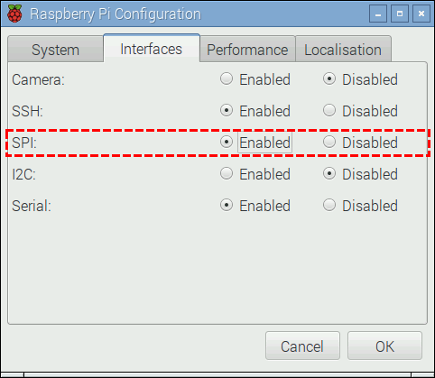

# AppBusiness

No Raspbberry Pi a comunicação do leitor RFID RC522 é feita através da interface SPI (Serial Peripheral Interface). O SPI utiliza comunicação síncrona, full duplex, utilizando o modelo de comunicação mestre-escravo.

Na imagem abaixo é possível observar quais são os pinos correspondentes ao SPI na GPIO do Raspberry Pi 3, eles estão destacados com a cor roxa.


### Conexão módulo RFID com Raspberry Pi
Na tabela abaixo está descrito o pino do módulo RFID e seu respectivo pino/GPIO. Siga o esquema de conexão mostrado na tabela para utilizar o RFID com Raspberry Pi 3. Atenção, a tensão do módulo é de 3.3 volts.


### Preparando o ambiente
Esse passo a passo é para o Raspbian `Jessie versão 2016-03-18` (download), versões após esta release estão com problemas na interface SPI, e versões do Wheezy não suportam Device Tree, usado no exemplo abaixo. Leia mais sobre Device Tree na documentação do Raspberry. Caso você deseje configurar outra versão do Raspbian siga o tutorial da documentação do SPI.

O Raspbian vem com SPI desabilitado por padrão, para verificar se está ou não habilitado vamos executar o comando a seguir:

```bash
ls /dev/spi*
```

Se o resultado for o seguinte:
```bash
ls: cannot access /dev/spi*: No such file or directory
```

Nesse caso devemos habilitar o SPI.
Para habilitar o SPI no Raspbian acesse o `Menu > Preferences > Raspberry Pi Configuration` e na aba Interface habilite `SPI`. Clique em OK.




Em seguida, no seu editor de texto preferido abra o arquivo /boot/config.txt (como root) e adicione a seguinte linha:

```bash
dtoverlay=spi-bcm2708
```

Reinicie o Raspbian e verifique novamente, o resultado deverá ser:

```bash
/dev/spidev0.0 /dev/spidev0.1
```

Verifique se o módulo SPI foi carregado corretamente através do comando:

```bash
dmesg | grep spi
```

O resultado deverá ser algo semelhante ao abaixo, indicando a comunicação RFID com Raspberry Pi:

```bash
[ 6.240564] bcm2708_spi 3f204000.spi: master is unqueued, this is deprecated
[ 6.241262] bcm2708_spi 3f204000.spi: SPI Controller at 0x3f204000 (irq 80)
```

Para utilizar o módulo RC522 no Python necessitamos instalar alguns componentes antes de começar a programar. Primeiramente iremos instalar o pacote python-dev através do comando:

```bash
sudo apt-get install python-dev
```

Após instalado iremos instalar o pacote Python para comunicação SPI, para isto execute os comandos abaixo:

```bash
git clone https://github.com/Robot-Hockey/AppBusiness.git
cd AppBusiness
sudo python setup.py install
```
### How to run

```bash
python main.py
```

Ao aproximar uma tag `RFID` do módulo, caso o `UID` esteja na lista ADMIN_CARDS você verá uma mensagem semelhante a abaixo:

```bash
Show your card RFID
Card detected!
UID do cartão: 4F:FD:2F:0:9D
```

Caso contrário será exibida uma mensagem semelhante a esta:

```
Show your card RFID
Card detected!
UID do cartão: 6B:4:FE:E5:74
```